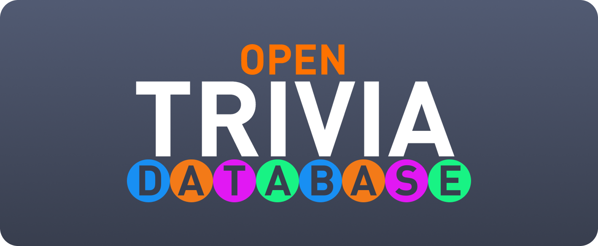

# swift-opentdb



A lightweight Swift package for fetching trivia questions from the [Open Trivia Database (OpenTDB)](https://opentdb.com/).

## Features

- Fetch trivia questions with customizable categories, difficulty levels, and question types.
- Decodes JSON responses into Swift models.
- Simple and intuitive API for seamless integration into your iOS, macOS, watchOS, or tvOS projects.

## Installation

### Swift Package Manager (SPM)

1. Open your Xcode project.
2. Navigate to **File > Add Packages**.
3. Enter the repository URL
4. Select the latest version and add the package to your project.

``` HTML
https://github.com/kodydeda4/swift-opentdb.git
```

## Usage

### Import the Package

```swift
import OpenTDB
```

### Fetch Categories

You can fetch the entire list of categories and ids in the database with `fetchAllCategories()`.

```swift
let openTDB = OpenTDBClient()
let categories: [OpenTDBClient.Category] try await openTDB.fetchAllCategories().triviaCategories
```

Here's what the swift type looks like:

```swift
public struct OpenTDBClient.Category: Sendable, Identifiable, Equatable, Codable, Hashable {
  public let id: Int
  public let name: String
}
```

### Fetch Questions

You can fetch questions with `fetchQuestions()`.

```swift
let openTDB = OpenTDBClient()
let questions: [OpenTDBClient.Question] = try await openTDB.fetchQuestions(
  amount: 10, 
  categoryId: 0, 
  type: .mulipleChoice
)
.results
```

Here's what the swift type looks like:

```swift
public struct OpenTDBClient.Question: Sendable, Identifiable, Equatable, Codable, Hashable {
  public var id: String { question }
  public let type: String
  public let difficulty: String
  public let category: String
  public let question: String
  public let correctAnswer: String
  public let incorrectAnswers: [String]
}
```

## License

This project is licensed under the MIT License. See [LICENSE](LICENSE) for details.
